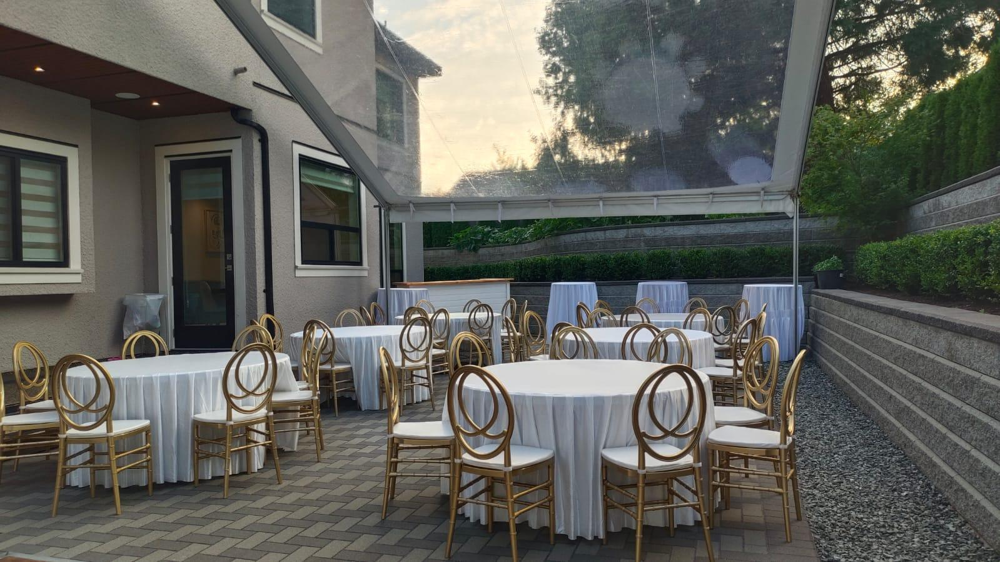
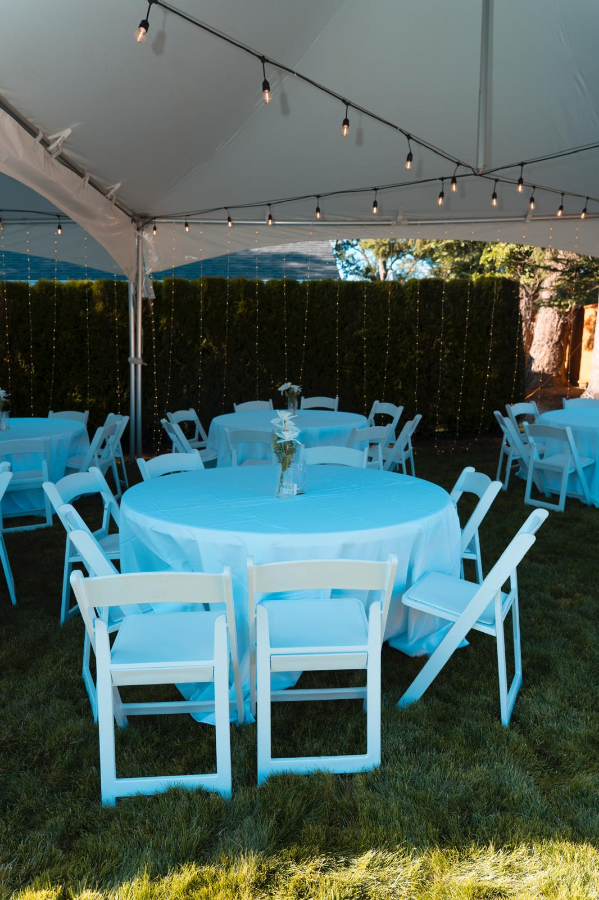
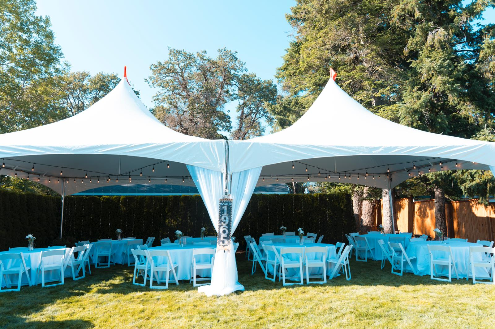
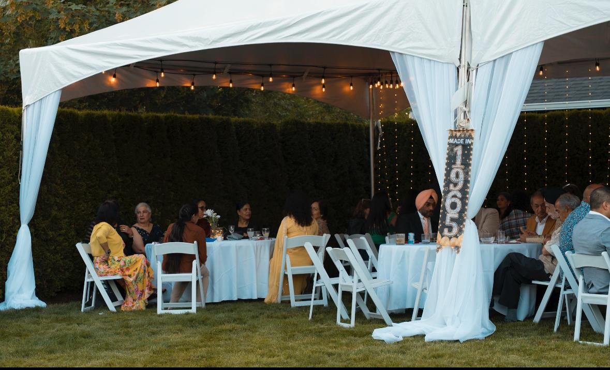

# Building Regal Party Rentals Website

## Complete Guide for HTML5 Bootstrap Single-Page Static Site with BC SEO

---

## Local SEO Strategy

### Critical SEO Elements for BC Market

#### 1. **Google My Business Optimization**

Create and optimize your Google Business Profile:

```
Business Name: Regal Party Rentals
Category: Party Equipment Rental Service
Additional Categories: 
- Tent Rental Service
- Wedding Service
- Event Management Company

Service Areas:
- Victoria, BC
- Vancouver Island
- Vancouver, BC
- Surrey, BC
- Langley, BC
- Saanich, BC
- Oak Bay, BC
- Esquimalt, BC
- Nanaimo, BC
- And all areas listed in the locations section

Business Description:
"Regal Party Rentals provides premium tent and party equipment rentals across British Columbia. Serving Victoria, Vancouver Island, Vancouver, Surrey, and Langley with professional event solutions for weddings, corporate events, and special occasions. Family-owned and operated since [YEAR]."

Attributes to select:
✓ LGBTQ+ friendly
✓ Wheelchair accessible
✓ Free Wi-Fi (if applicable)
✓ Identifies as women-owned (if applicable)
```

**Important GMB Actions:**
- Post weekly updates with photos
- Respond to all reviews within 24 hours
- Add high-quality photos (minimum 10 images)
- Create Google Posts for events and promotions
- Enable messaging feature
- Keep hours updated

#### 2. **Local Keywords Strategy**

**Primary Keywords (High Priority):**
- tent rentals Victoria BC
- party rentals Vancouver Island
- wedding tent rental Victoria
- event rentals Vancouver BC
- tent rental Surrey BC
- party equipment rental Langley
- Victoria wedding tent
- corporate event rentals Vancouver
- tent rental Vancouver Island

**Secondary Keywords:**
- Victoria BC event tents
- Vancouver Island party supplies
- wedding reception tent Victoria
- outdoor event rental BC
- tent rental Saanich
- party tent Vancouver
- Surrey wedding rentals
- Langley event rentals
- BC tent rental company
- Greater Victoria tent rentals

**Long-tail Keywords:**
- affordable tent rental Victoria BC
- wedding tent rental Vancouver Island prices
- best party rental company Victoria
- large event tent rental Vancouver
- outdoor wedding tent rental Surrey
- corporate tent rental Lower Mainland
- tent rental with setup Victoria
- party tent delivery Vancouver Island

#### 3. **Content Optimization Strategy**

**Homepage Title Tag Variations:**
```html
<!-- Option 1: Location-focused -->
<title>Tent Rentals Victoria BC | Party Rentals Vancouver Island | Regal Party Rentals</title>

<!-- Option 2: Service-focused -->
<title>Wedding & Event Tent Rentals | Victoria, Vancouver, Surrey | Regal Party Rentals</title>

<!-- Option 3: Comprehensive -->
<title>Regal Party Rentals | Premium Tent & Event Rentals in BC | Victoria to Vancouver</title>
```

**Meta Description Best Practices:**
```html
<meta name="description" content="Regal Party Rentals offers premium tent and party equipment rentals in Victoria BC, Vancouver Island, Vancouver, Surrey, and Langley. Professional wedding tents, corporate event solutions, and 24/7 support. Free quotes available. Serving BC since [YEAR].">
```

#### 4. **Location Pages Strategy**

For better SEO, consider creating individual location pages (can be done with anchor links on single page):

```html
<!-- Victoria Section SEO-Enhanced -->
<section id="victoria-rentals" class="location-detail">
    <h2>Tent Rentals in Victoria, BC</h2>
    <p>Regal Party Rentals is proud to serve Victoria, BC and the Greater Victoria region with premium tent and party equipment rentals. Our Victoria location provides same-day delivery to Saanich, Oak Bay, Esquimalt, and surrounding areas...</p>
    
    <h3>Popular Victoria Venues We Service:</h3>
    <ul>
        <li>Hatley Castle</li>
        <li>Abkhazi Garden</li>
        <li>Butchart Gardens</li>
        <li>Royal Colwood Golf Club</li>
        <li>The View Royal</li>
    </ul>
</section>
```

#### 5. **Local Business Citations**

Submit your business to these BC directories:

**Essential Citations:**
- Google My Business ⭐ (Most Important)
- Bing Places
- Apple Maps
- Facebook Business
- Yelp Canada
- Yellow Pages Canada
- 411.ca
- Canada411
- BBB (Better Business Bureau)

**Industry-Specific:**
- WeddingWire Canada
- The Knot
- Eventective
- PartyPOP
- EventSource
- GigSalad

**Local BC Directories:**
- Tourism Victoria
- Tourism Vancouver
- BC Business Directory
- Victoria Chamber of Commerce
- Vancouver Board of Trade
- Surrey Board of Trade
- Langley Chamber of Commerce
- Vancouver Island directories

**Consistency Requirements:**
Ensure NAP (Name, Address, Phone) is identical across all platforms:
```
Regal Party Rentals
[Your Street Address]
Victoria, BC V8X XXX
(250) 555-1234
info@regalpartyrentals.ca
http://www.regalpartyrentals.ca
```

#### 6. **Review Strategy**

**Review Generation Plan:**
1. Send follow-up email 2 days after event
2. Include direct Google review link
3. Respond to ALL reviews (positive and negative)
4. Aim for 50+ Google reviews in first year

**Review Response Templates:**

Positive Review Response:
```
"Thank you so much for your kind words, [Name]! We're thrilled we could make your [event type] in [location] special. It was our pleasure to work with you. We look forward to serving you again for future events in Victoria/Vancouver Island!"
```

Negative Review Response:
```
"Thank you for bringing this to our attention, [Name]. We sincerely apologize for the issues you experienced. This doesn't meet our standards for service in [location]. We'd like to make this right - please contact us directly at (250) 555-1234 or info@regalpartyrentals.ca so we can resolve this immediately."
```

#### 7. **Local Link Building**

**Target Local Backlinks:**
- Victoria wedding venues (ask for vendor list inclusion)
- Vancouver Island event planners
- BC wedding blogs and publications
- Local business associations
- Chamber of Commerce websites
- Tourism websites
- Local event venues
- Wedding photographers in BC
- Catering companies
- Florists and decorators

**Content Ideas for Links:**
- "Ultimate Guide to Outdoor Weddings on Vancouver Island"
- "Top 10 Wedding Venues in Victoria BC"
- "Planning a Corporate Event in Vancouver: A Complete Guide"
- "Weather-Proof Your BC Event: Tent Rental Tips"

#### 8. **Social Media Local Optimization**

**Facebook:**
- Enable location tagging
- Check-ins enabled
- Post tagged location content
- Join Victoria/Vancouver event groups
- Share customer photos with location tags

**Instagram:**
- Use local hashtags: #VictoriaBC #VancouverIsland #VancouverWedding #SurreyBC #LangleyBC
- Geotag all posts with specific BC locations
- Tag local venues and businesses
- Story highlights for each service area

**Local Hashtag Strategy:**
```
#VictoriaBCWeddings
#VancouverIslandEvents
#VancouverWedding
#SurreyEvents
#LangleyWeddings
#BCEventRentals
#YYJWeddings
#VictoriaWeddings
#VancouverIslandWeddings
#BCBride
#VancouverBride
```

---

## Schema Markup

### Complete Schema Implementation

Add this enhanced schema to your HTML head:

```html
<script type="application/ld+json">
{
  "@context": "https://schema.org",
  "@graph": [
    {
      "@type": "LocalBusiness",
      "@id": "http://www.regalpartyrentals.ca/#business",
      "name": "Regal Party Rentals",
      "image": {
        "@type": "ImageObject",
        "url": "http://www.regalpartyrentals.ca/images/logo.png",
        "width": 800,
        "height": 600
      },
      "logo": {
        "@type": "ImageObject",
        "url": "http://www.regalpartyrentals.ca/images/logo.png"
      },
      "url": "http://www.regalpartyrentals.ca",
      "telephone": "+1-250-555-1234",
      "email": "info@regalpartyrentals.ca",
      "priceRange": "$",
      "address": {
        "@type": "PostalAddress",
        "streetAddress": "Your Street Address",
        "addressLocality": "Victoria",
        "addressRegion": "BC",
        "postalCode": "V8X XXX",
        "addressCountry": "CA"
      },
      "geo": {
        "@type": "GeoCoordinates",
        "latitude": 48.4284,
        "longitude": -123.3656
      },
      "openingHoursSpecification": [
        {
          "@type": "OpeningHoursSpecification",
          "dayOfWeek": ["Monday", "Tuesday", "Wednesday", "Thursday", "Friday"],
          "opens": "09:00",
          "closes": "17:00"
        }
      ],
      "sameAs": [
        "https://www.facebook.com/regalpartyrentals",
        "https://www.instagram.com/regalpartyrentals",
        "https://www.linkedin.com/company/regalpartyrentals"
      ],
      "areaServed": [
        {
          "@type": "City",
          "name": "Victoria",
          "@id": "https://en.wikipedia.org/wiki/Victoria,_British_Columbia"
        },
        {
          "@type": "Place",
          "name": "Vancouver Island",
          "@id": "https://en.wikipedia.org/wiki/Vancouver_Island"
        },
        {
          "@type": "City",
          "name": "Vancouver",
          "@id": "https://en.wikipedia.org/wiki/Vancouver"
        },
        {
          "@type": "City",
          "name": "Surrey",
          "@id": "https://en.wikipedia.org/wiki/Surrey,_British_Columbia"
        },
        {
          "@type": "City",
          "name": "Langley",
          "@id": "https://en.wikipedia.org/wiki/Langley,_British_Columbia_(district_municipality)"
        },
        {
          "@type": "City",
          "name": "Saanich"
        },
        {
          "@type": "City",
          "name": "Nanaimo"
        }
      ],
      "hasOfferCatalog": {
        "@type": "OfferCatalog",
        "name": "Tent and Party Rental Services",
        "itemListElement": [
          {
            "@type": "Offer",
            "itemOffered": {
              "@type": "Service",
              "name": "Wedding Tent Rentals",
              "description": "Elegant tent rentals for weddings and receptions"
            }
          },
          {
            "@type": "Offer",
            "itemOffered": {
              "@type": "Service",
              "name": "Corporate Event Tent Rentals",
              "description": "Professional tent solutions for corporate events"
            }
          },
          {
            "@type": "Offer",
            "itemOffered": {
              "@type": "Service",
              "name": "Party Equipment Rentals",
              "description": "Tables, chairs, lighting, and more"
            }
          }
        ]
      },
      "aggregateRating": {
        "@type": "AggregateRating",
        "ratingValue": "4.9",
        "reviewCount": "87",
        "bestRating": "5",
        "worstRating": "1"
      }
    },
    {
      "@type": "WebSite",
      "@id": "http://www.regalpartyrentals.ca/#website",
      "url": "http://www.regalpartyrentals.ca",
      "name": "Regal Party Rentals",
      "publisher": {
        "@id": "http://www.regalpartyrentals.ca/#business"
      },
      "potentialAction": {
        "@type": "SearchAction",
        "target": "http://www.regalpartyrentals.ca/#search={search_term_string}",
        "query-input": "required name=search_term_string"
      }
    },
    {
      "@type": "BreadcrumbList",
      "@id": "http://www.regalpartyrentals.ca/#breadcrumb",
      "itemListElement": [
        {
          "@type": "ListItem",
          "position": 1,
          "name": "Home",
          "item": "http://www.regalpartyrentals.ca"
        }
      ]
    }
  ]
}
</script>
```

### Service-Specific Schema

For better search visibility, add service-specific schema:

```html
<script type="application/ld+json">
{
  "@context": "https://schema.org",
  "@type": "Service",
  "serviceType": "Tent Rental Service",
  "provider": {
    "@type": "LocalBusiness",
    "name": "Regal Party Rentals"
  },
  "areaServed": {
    "@type": "State",
    "name": "British Columbia"
  },
  "hasOfferCatalog": {
    "@type": "OfferCatalog",
    "name": "Tent Rental Services in BC",
    "itemListElement": [
      {
        "@type": "Offer",
        "itemOffered": {
          "@type": "Service",
          "name": "Wedding Tent Rental",
          "url": "http://www.regalpartyrentals.ca/#services"
        }
      }
    ]
  }
}
</script>
```

---

## Additional SEO Files

### robots.txt

Create a `robots.txt` file in your root directory:

```txt
User-agent: *
Allow: /

Sitemap: http://www.regalpartyrentals.ca/sitemap.xml
```

### sitemap.xml

Create a `sitemap.xml` file:

```xml
<?xml version="1.0" encoding="UTF-8"?>
<urlset xmlns="http://www.sitemaps.org/schemas/sitemap/0.9">
  <url>
    <loc>http://www.regalpartyrentals.ca/</loc>
    <lastmod>2024-01-01</lastmod>
    <changefreq>weekly</changefreq>
    <priority>1.0</priority>
  </url>
  <url>
    <loc>http://www.regalpartyrentals.ca/#services</loc>
    <lastmod>2024-01-01</lastmod>
    <changefreq>monthly</changefreq>
    <priority>0.8</priority>
  </url>
  <url>
    <loc>http://www.regalpartyrentals.ca/#locations</loc>
    <lastmod>2024-01-01</lastmod>
    <changefreq>monthly</changefreq>
    <priority>0.8</priority>
  </url>
  <url>
    <loc>http://www.regalpartyrentals.ca/#contact</loc>
    <lastmod>2024-01-01</lastmod>
    <changefreq>monthly</changefreq>
    <priority>0.7</priority>
  </url>
</urlset>
```

---

## Table of Contents

1. [Project Overview](#project-overview)
2. [Prerequisites](#prerequisites)
3. [Project Structure](#project-structure)
4. [HTML Structure with SEO](#html-structure-with-seo)
5. [Bootstrap Components](#bootstrap-components)
6. [Content Sections](#content-sections)
7. [Mobile Optimization](#mobile-optimization)
8. [Custom CSS](#custom-css)
9. [JavaScript Functionality](#javascript-functionality)
10. [Local SEO Strategy](#local-seo-strategy)
11. [Schema Markup](#schema-markup)
12. [Deployment](#deployment)

---

## Project Overview

This guide details how to build a professional, mobile-friendly website for **Regal Party Rentals** with comprehensive SEO optimization for British Columbia locations including Victoria, Vancouver Island, Vancouver, Surrey, and Langley. The site will be a single-page application with smooth scrolling navigation, responsive design, and local search optimization.

### Target Service Areas
- **Victoria, BC** (Primary location)
- **Vancouver Island** (Nanaimo, Duncan, Parksville, Courtenay, Campbell River)
- **Vancouver** (Metro Vancouver)
- **Surrey, BC**
- **Langley, BC**
- **Surrounding Lower Mainland areas**

### Key Features
- Single-page layout with smooth scroll navigation
- Fully responsive Bootstrap 5 framework
- Hero section with compelling call-to-action
- Service showcase sections
- Location-specific SEO optimization
- Schema.org structured data
- Google My Business integration
- Image galleries
- Contact form
- Mobile-first design approach

---

## Prerequisites

### Required Knowledge
- Basic HTML5
- CSS3 fundamentals
- Basic JavaScript
- Understanding of responsive design

### Tools & Resources
- Text editor (VS Code, Sublime Text, etc.)
- Bootstrap 5 CDN
- Web browser for testing
- Image optimization tools

---

## Project Structure

```
regal-party-rentals/
│
├── index.html
├── css/
│   └── custom.css
├── js/
│   └── script.js
├── images/
│   ├── hero-bg.jpg
│   ├── tent-1.jpg
│   ├── tent-2.jpg
│   └── logo.png
├── sitemap.xml
├── robots.txt
└── README.md
```

---

## HTML Structure with SEO

### Complete HTML Template with Local SEO

```html
<!DOCTYPE html>
<html lang="en-CA">
<head>
    <meta charset="UTF-8">
    <meta name="viewport" content="width=device-width, initial-scale=1.0">
    
    <!-- Primary SEO Meta Tags -->
    <title>Regal Party Rentals | Tent & Event Rentals Victoria BC | Vancouver Island</title>
    <meta name="title" content="Regal Party Rentals | Tent & Event Rentals Victoria BC | Vancouver Island">
    <meta name="description" content="Premium tent and party rentals in Victoria BC, Vancouver Island, Vancouver, Surrey, and Langley. Wedding tents, corporate events, and special occasions. Serving all of BC since [year].">
    <meta name="keywords" content="tent rentals Victoria BC, party rentals Vancouver Island, wedding tent rental Vancouver, event rentals Surrey, tent rental Langley, Victoria party rentals, BC event rentals">
    <meta name="author" content="Regal Party Rentals">
    <meta name="robots" content="index, follow">
    <link rel="canonical" href="http://www.regalpartyrentals.ca/">
    
    <!-- Geographic Meta Tags -->
    <meta name="geo.region" content="CA-BC">
    <meta name="geo.placename" content="Victoria, British Columbia">
    <meta name="geo.position" content="48.4284;-123.3656">
    <meta name="ICBM" content="48.4284, -123.3656">
    
    <!-- Open Graph / Facebook -->
    <meta property="og:type" content="website">
    <meta property="og:url" content="http://www.regalpartyrentals.ca/">
    <meta property="og:title" content="Regal Party Rentals | Tent & Event Rentals Victoria BC">
    <meta property="og:description" content="Premium tent and party rentals serving Victoria, Vancouver Island, Vancouver, Surrey, and Langley. Professional event solutions for weddings, corporate events, and special occasions.">
    <meta property="og:image" content="http://www.regalpartyrentals.ca/images/og-image.jpg">
    <meta property="og:locale" content="en_CA">
    
    <!-- Twitter -->
    <meta property="twitter:card" content="summary_large_image">
    <meta property="twitter:url" content="http://www.regalpartyrentals.ca/">
    <meta property="twitter:title" content="Regal Party Rentals | Tent & Event Rentals Victoria BC">
    <meta property="twitter:description" content="Premium tent and party rentals serving Victoria, Vancouver Island, Vancouver, Surrey, and Langley.">
    <meta property="twitter:image" content="http://www.regalpartyrentals.ca/images/twitter-image.jpg">
    
    <!-- Favicon -->
    <link rel="icon" type="image/png" sizes="32x32" href="/favicon-32x32.png">
    <link rel="icon" type="image/png" sizes="16x16" href="/favicon-16x16.png">
    <link rel="apple-touch-icon" sizes="180x180" href="/apple-touch-icon.png">
    
    <!-- Bootstrap 5 CSS -->
    <link href="https://cdn.jsdelivr.net/npm/bootstrap@5.3.0/dist/css/bootstrap.min.css" rel="stylesheet">
    
    <!-- Bootstrap Icons -->
    <link rel="stylesheet" href="https://cdn.jsdelivr.net/npm/bootstrap-icons@1.10.0/font/bootstrap-icons.css">
    
    <!-- Custom CSS -->
    <link rel="stylesheet" href="css/custom.css">
    
    <!-- Google Analytics (Replace with your tracking ID) -->
    <script async src="https://www.googletagmanager.com/gtag/js?id=G-XXXXXXXXXX"></script>
    <script>
      window.dataLayer = window.dataLayer || [];
      function gtag(){dataLayer.push(arguments);}
      gtag('js', new Date());
      gtag('config', 'G-XXXXXXXXXX');
    </script>
    
    <!-- Local Business Schema Markup -->
    <script type="application/ld+json">
    {
      "@context": "https://schema.org",
      "@type": "LocalBusiness",
      "name": "Regal Party Rentals",
      "image": "http://www.regalpartyrentals.ca/images/logo.png",
      "@id": "http://www.regalpartyrentals.ca",
      "url": "http://www.regalpartyrentals.ca",
      "telephone": "+1-250-XXX-XXXX",
      "priceRange": "$",
      "address": {
        "@type": "PostalAddress",
        "streetAddress": "Your Street Address",
        "addressLocality": "Victoria",
        "addressRegion": "BC",
        "postalCode": "V8X XXX",
        "addressCountry": "CA"
      },
      "geo": {
        "@type": "GeoCoordinates",
        "latitude": 48.4284,
        "longitude": -123.3656
      },
      "openingHoursSpecification": {
        "@type": "OpeningHoursSpecification",
        "dayOfWeek": [
          "Monday",
          "Tuesday",
          "Wednesday",
          "Thursday",
          "Friday"
        ],
        "opens": "09:00",
        "closes": "17:00"
      },
      "sameAs": [
        "https://www.facebook.com/regalpartyrentals",
        "https://www.instagram.com/regalpartyrentals"
      ],
      "areaServed": [
        {
          "@type": "City",
          "name": "Victoria",
          "containedInPlace": {
            "@type": "State",
            "name": "British Columbia"
          }
        },
        {
          "@type": "Place",
          "name": "Vancouver Island"
        },
        {
          "@type": "City",
          "name": "Vancouver"
        },
        {
          "@type": "City",
          "name": "Surrey"
        },
        {
          "@type": "City",
          "name": "Langley"
        }
      ],
      "serviceType": [
        "Tent Rentals",
        "Party Rentals",
        "Wedding Rentals",
        "Event Rentals",
        "Corporate Event Rentals"
      ]
    }
    </script>
</head>
<body>
    <!-- Navigation -->
    <!-- Hero Section -->
    <!-- Services Section -->
    <!-- About Section -->
    <!-- Gallery Section -->
    <!-- Contact Section -->
    <!-- Footer -->
    
    <!-- Bootstrap JS Bundle -->
    <script src="https://cdn.jsdelivr.net/npm/bootstrap@5.3.0/dist/js/bootstrap.bundle.min.js"></script>
    
    <!-- Custom JS -->
    <script src="js/script.js"></script>
</body>
</html>
```

---

## Bootstrap Components

### 1. Navigation Bar

Create a sticky, collapsible navigation that works on all devices:

```html
<nav class="navbar navbar-expand-lg navbar-light bg-light fixed-top">
    <div class="container">
        <a class="navbar-brand" href="#" aria-label="Regal Party Rentals Home">
            
            <span class="ms-2 fw-bold">REGAL PARTY RENTALS</span>
        </a>
        <button class="navbar-toggler" type="button" data-bs-toggle="collapse" data-bs-target="#navbarNav" aria-controls="navbarNav" aria-expanded="false" aria-label="Toggle navigation">
            <span class="navbar-toggler-icon"></span>
        </button>
        <div class="collapse navbar-collapse" id="navbarNav">
            <ul class="navbar-nav ms-auto">
                <li class="nav-item">
                    <a class="nav-link" href="#home">Home</a>
                </li>
                <li class="nav-item">
                    <a class="nav-link" href="#services">Services</a>
                </li>
                <li class="nav-item">
                    <a class="nav-link" href="#locations">Service Areas</a>
                </li>
                <li class="nav-item">
                    <a class="nav-link" href="#about">About</a>
                </li>
                <li class="nav-item">
                    <a class="nav-link" href="#gallery">Gallery</a>
                </li>
                <li class="nav-item">
                    <a class="nav-link" href="#contact">Contact</a>
                </li>
            </ul>
        </div>
    </div>
</nav>
```

### 2. Hero Section

```html
<section id="home" class="hero-section">
    <div class="hero-overlay">
        <div class="container">
            <div class="row align-items-center min-vh-100">
                <div class="col-lg-8 mx-auto text-center text-white">
                    <h1 class="display-3 fw-bold mb-4">Regal Party Rentals</h1>
                    <p class="lead mb-3">Premium Tent & Event Rentals in British Columbia</p>
                    <p class="h5 mb-5">Serving Victoria, Vancouver Island, Vancouver, Surrey & Langley</p>
                    <a href="#contact" class="btn btn-primary btn-lg me-3">Get a Free Quote</a>
                    <a href="#services" class="btn btn-outline-light btn-lg">View Services</a>
                </div>
            </div>
        </div>
    </div>
</section>
```

---

## Content Sections

### Services Section

Based on Cascade Tent Rentals and Sperry Tents Seattle, include these service categories with SEO-optimized content:

```html
<section id="services" class="py-5">
    <div class="container">
        <div class="row mb-5">
            <div class="col-lg-8 mx-auto text-center">
                <h2 class="display-4 fw-bold mb-3">Our Tent & Party Rental Services</h2>
                <p class="lead text-muted">Professional event solutions across British Columbia</p>
            </div>
        </div>
        
        <div class="row g-4">
            <!-- Wedding Tents -->
            <div class="col-md-6 col-lg-4">
                <div class="card h-100 shadow-sm">
                    
                    <div class="card-body">
                        <h3 class="card-title h4">Wedding Tent Rentals</h3>
                        <p class="card-text">Create the perfect backdrop for your Victoria or Vancouver Island wedding with our elegant tent rentals. From intimate ceremonies to grand receptions of 300+ guests.</p>
                        <a href="#contact" class="btn btn-outline-primary">Request Quote</a>
                    </div>
                </div>
            </div>
            
            <!-- Corporate Events -->
            <div class="col-md-6 col-lg-4">
                <div class="card h-100 shadow-sm">
                    
                    <div class="card-body">
                        <h3 class="card-title h4">Corporate Events</h3>
                        <p class="card-text">Professional tent solutions for conferences, team building events, and customer appreciation gatherings.</p>
                        <a href="#contact" class="btn btn-outline-primary">Learn More</a>
                    </div>
                </div>
            </div>
            
            <!-- Private Functions -->
            <div class="col-md-6 col-lg-4">
                <div class="card h-100 shadow-sm">
                    
                    <div class="card-body">
                        <h3 class="card-title h4">Private Functions</h3>
                        <p class="card-text">Perfect for birthday parties, anniversaries, family reunions, and any special occasion.</p>
                        <a href="#contact" class="btn btn-outline-primary">Learn More</a>
                    </div>
                </div>
            </div>
            
            <!-- Festival & Production -->
            <div class="col-md-6 col-lg-4">
                <div class="card h-100 shadow-sm">
                    
                    <div class="card-body">
                        <h3 class="card-title h4">Festivals & Productions</h3>
                        <p class="card-text">Large-scale tent solutions for festivals, food vendors, and production crews.</p>
                        <a href="#contact" class="btn btn-outline-primary">Learn More</a>
                    </div>
                </div>
            </div>
            
            <!-- Industrial -->
            <div class="col-md-6 col-lg-4">
                <div class="card h-100 shadow-sm">
                    
                    <div class="card-body">
                        <h3 class="card-title h4">Industrial & Construction</h3>
                        <p class="card-text">Durable construction tents to protect work sites from the elements, available for short or long-term rental.</p>
                        <a href="#contact" class="btn btn-outline-primary">Learn More</a>
                    </div>
                </div>
            </div>
            
            <!-- Additional Rentals -->
            <div class="col-md-6 col-lg-4">
                <div class="card h-100 shadow-sm">
                    
                    <div class="card-body">
                        <h3 class="card-title h4">Additional Rentals</h3>
                        <p class="card-text">Tables, chairs, lighting, heating, drapery, flooring, and more to complete your event.</p>
                        <a href="#contact" class="btn btn-outline-primary">Learn More</a>
                    </div>
                </div>
            </div>
        </div>
    </div>
</section>
```

### Location Service Areas Section (NEW - SEO Critical)

Add this section after services to boost local SEO:

```html
<section id="locations" class="py-5 bg-light">
    <div class="container">
        <div class="row mb-5">
            <div class="col-lg-10 mx-auto text-center">
                <h2 class="display-4 fw-bold mb-3">Proudly Serving British Columbia</h2>
                <p class="lead text-muted">Professional tent and party rentals delivered across BC's most beautiful regions</p>
            </div>
        </div>
        
        <div class="row g-4">
            <!-- Victoria -->
            <div class="col-md-6 col-lg-4">
                <div class="location-card p-4 bg-white rounded-3 shadow-sm h-100">
                    <div class="location-icon mb-3">
                        <i class="bi bi-geo-alt-fill text-primary" style="font-size: 2.5rem;"></i>
                    </div>
                    <h3 class="h4 mb-3">Victoria, BC</h3>
                    <p class="mb-3">Our primary service area covering Greater Victoria, Saanich, Oak Bay, Esquimalt, and surrounding communities.</p>
                    <ul class="list-unstyled small text-muted">
                        <li><i class="bi bi-check-circle-fill text-success me-2"></i>Same-day delivery available</li>
                        <li><i class="bi bi-check-circle-fill text-success me-2"></i>Free site consultations</li>
                        <li><i class="bi bi-check-circle-fill text-success me-2"></i>24/7 emergency support</li>
                    </ul>
                </div>
            </div>
            
            <!-- Vancouver Island -->
            <div class="col-md-6 col-lg-4">
                <div class="location-card p-4 bg-white rounded-3 shadow-sm h-100">
                    <div class="location-icon mb-3">
                        <i class="bi bi-geo-alt-fill text-primary" style="font-size: 2.5rem;"></i>
                    </div>
                    <h3 class="h4 mb-3">Vancouver Island</h3>
                    <p class="mb-3">Full-service coverage for Nanaimo, Duncan, Parksville, Courtenay, Campbell River, and the entire island.</p>
                    <ul class="list-unstyled small text-muted">
                        <li><i class="bi bi-check-circle-fill text-success me-2"></i>Island-wide delivery</li>
                        <li><i class="bi bi-check-circle-fill text-success me-2"></i>Scheduled installations</li>
                        <li><i class="bi bi-check-circle-fill text-success me-2"></i>Local expertise</li>
                    </ul>
                </div>
            </div>
            
            <!-- Vancouver Metro -->
            <div class="col-md-6 col-lg-4">
                <div class="location-card p-4 bg-white rounded-3 shadow-sm h-100">
                    <div class="location-icon mb-3">
                        <i class="bi bi-geo-alt-fill text-primary" style="font-size: 2.5rem;"></i>
                    </div>
                    <h3 class="h4 mb-3">Vancouver</h3>
                    <p class="mb-3">Serving Metro Vancouver including downtown, North Vancouver, West Vancouver, Burnaby, and Richmond.</p>
                    <ul class="list-unstyled small text-muted">
                        <li><i class="bi bi-check-circle-fill text-success me-2"></i>Metro-wide service</li>
                        <li><i class="bi bi-check-circle-fill text-success me-2"></i>Urban event specialists</li>
                        <li><i class="bi bi-check-circle-fill text-success me-2"></i>Flexible scheduling</li>
                    </ul>
                </div>
            </div>
            
            <!-- Surrey -->
            <div class="col-md-6 col-lg-4">
                <div class="location-card p-4 bg-white rounded-3 shadow-sm h-100">
                    <div class="location-icon mb-3">
                        <i class="bi bi-geo-alt-fill text-primary" style="font-size: 2.5rem;"></i>
                    </div>
                    <h3 class="h4 mb-3">Surrey, BC</h3>
                    <p class="mb-3">Complete party and tent rental services throughout Surrey, including Cloverdale, Guildford, and South Surrey/White Rock.</p>
                    <ul class="list-unstyled small text-muted">
                        <li><i class="bi bi-check-circle-fill text-success me-2"></i>Fast response times</li>
                        <li><i class="bi bi-check-circle-fill text-success me-2"></i>Competitive pricing</li>
                        <li><i class="bi bi-check-circle-fill text-success me-2"></i>Professional setup</li>
                    </ul>
                </div>
            </div>
            
            <!-- Langley -->
            <div class="col-md-6 col-lg-4">
                <div class="location-card p-4 bg-white rounded-3 shadow-sm h-100">
                    <div class="location-icon mb-3">
                        <i class="bi bi-geo-alt-fill text-primary" style="font-size: 2.5rem;"></i>
                    </div>
                    <h3 class="h4 mb-3">Langley, BC</h3>
                    <p class="mb-3">Serving Langley City, Township of Langley, Fort Langley, and Aldergrove with premium event rental solutions.</p>
                    <ul class="list-unstyled small text-muted">
                        <li><i class="bi bi-check-circle-fill text-success me-2"></i>Rural & urban events</li>
                        <li><i class="bi bi-check-circle-fill text-success me-2"></i>Farm venue specialists</li>
                        <li><i class="bi bi-check-circle-fill text-success me-2"></i>Custom packages</li>
                    </ul>
                </div>
            </div>
            
            <!-- Additional Lower Mainland -->
            <div class="col-md-6 col-lg-4">
                <div class="location-card p-4 bg-white rounded-3 shadow-sm h-100">
                    <div class="location-icon mb-3">
                        <i class="bi bi-geo-alt-fill text-primary" style="font-size: 2.5rem;"></i>
                    </div>
                    <h3 class="h4 mb-3">Lower Mainland</h3>
                    <p class="mb-3">Extended service to Abbotsford, Chilliwack, Mission, Maple Ridge, Coquitlam, and throughout the Fraser Valley.</p>
                    <ul class="list-unstyled small text-muted">
                        <li><i class="bi bi-check-circle-fill text-success me-2"></i>Regional coverage</li>
                        <li><i class="bi bi-check-circle-fill text-success me-2"></i>Advance booking</li>
                        <li><i class="bi bi-check-circle-fill text-success me-2"></i>Reliable service</li>
                    </ul>
                </div>
            </div>
        </div>
        
        <div class="row mt-5">
            <div class="col-lg-8 mx-auto text-center">
                <div class="alert alert-info">
                    <i class="bi bi-info-circle-fill me-2"></i>
                    <strong>Can't find your location?</strong> We regularly serve additional areas throughout BC. Contact us to confirm service availability in your area.
                </div>
            </div>
        </div>
    </div>
</section>
```

### Features Section

```html
<section class="features-section bg-light py-5">
    <div class="container">
        <div class="row g-4">
            <div class="col-md-4 text-center">
                <div class="feature-icon mb-3">
                    <i class="bi bi-award-fill text-primary" style="font-size: 3rem;"></i>
                </div>
                <h3 class="h4">Premium Quality</h3>
                <p class="text-muted">Top-tier tents and party equipment, professionally maintained and inspected for every BC event.</p>
            </div>
            
            <div class="col-md-4 text-center">
                <div class="feature-icon mb-3">
                    <i class="bi bi-geo-alt-fill text-primary" style="font-size: 3rem;"></i>
                </div>
                <h3 class="h4">BC-Wide Service</h3>
                <p class="text-muted">From Victoria to Vancouver, Surrey to Langley - we deliver excellence across British Columbia.</p>
            </div>
            
            <div class="col-md-4 text-center">
                <div class="feature-icon mb-3">
                    <i class="bi bi-clock-fill text-primary" style="font-size: 3rem;"></i>
                </div>
                <h3 class="h4">24/7 Support</h3>
                <p class="text-muted">Round-the-clock emergency support to ensure your event runs smoothly, rain or shine.</p>
            </div>
        </div>
    </div>
</section>
```

### Contact Form Section

```html
<section id="contact" class="py-5">
    <div class="container">
        <div class="row">
            <div class="col-lg-8 mx-auto">
                <h2 class="display-4 fw-bold text-center mb-3">Get Your Free Quote</h2>
                <p class="text-center text-muted mb-5">Serving Victoria, Vancouver Island, Vancouver, Surrey & Langley</p>
                
                <form id="contactForm">
                    <div class="row g-3">
                        <div class="col-md-6">
                            <label for="name" class="form-label">Name *</label>
                            <input type="text" class="form-control" id="name" required>
                        </div>
                        
                        <div class="col-md-6">
                            <label for="email" class="form-label">Email *</label>
                            <input type="email" class="form-control" id="email" required>
                        </div>
                        
                        <div class="col-md-6">
                            <label for="phone" class="form-label">Phone *</label>
                            <input type="tel" class="form-control" id="phone" required>
                        </div>
                        
                        <div class="col-md-6">
                            <label for="eventDate" class="form-label">Event Date</label>
                            <input type="date" class="form-control" id="eventDate">
                        </div>
                        
                        <div class="col-md-6">
                            <label for="location" class="form-label">Event Location *</label>
                            <select class="form-select" id="location" required>
                                <option value="">Choose location...</option>
                                <option value="victoria">Victoria</option>
                                <option value="vancouver-island">Vancouver Island (Other)</option>
                                <option value="vancouver">Vancouver</option>
                                <option value="surrey">Surrey</option>
                                <option value="langley">Langley</option>
                                <option value="lower-mainland">Lower Mainland (Other)</option>
                            </select>
                        </div>
                        
                        <div class="col-md-6">
                            <label for="eventType" class="form-label">Event Type</label>
                            <select class="form-select" id="eventType">
                                <option selected>Choose...</option>
                                <option value="wedding">Wedding</option>
                                <option value="corporate">Corporate Event</option>
                                <option value="private">Private Function</option>
                                <option value="festival">Festival/Production</option>
                                <option value="industrial">Industrial/Construction</option>
                                <option value="other">Other</option>
                            </select>
                        </div>
                        
                        <div class="col-12">
                            <label for="guestCount" class="form-label">Estimated Guest Count</label>
                            <input type="number" class="form-control" id="guestCount" placeholder="e.g., 100">
                        </div>
                        
                        <div class="col-12">
                            <label for="message" class="form-label">Tell us about your event *</label>
                            <textarea class="form-control" id="message" rows="5" placeholder="Please include any specific requirements, tent sizes, or additional rental needs..." required></textarea>
                        </div>
                        
                        <div class="col-12">
                            <button type="submit" class="btn btn-primary btn-lg w-100">Request Free Quote</button>
                            <p class="text-center text-muted small mt-3">We typically respond within 2 hours during business hours</p>
                        </div>
                    </div>
                </form>
            </div>
        </div>
        
        <!-- Contact Information -->
        <div class="row mt-5 pt-5 border-top">
            <div class="col-md-4 text-center mb-4">
                <i class="bi bi-telephone-fill text-primary mb-3" style="font-size: 2rem;"></i>
                <h4>Phone</h4>
                <p class="mb-0"><a href="tel:+12505551234" class="text-decoration-none">(250) 555-1234</a></p>
            </div>
            <div class="col-md-4 text-center mb-4">
                <i class="bi bi-envelope-fill text-primary mb-3" style="font-size: 2rem;"></i>
                <h4>Email</h4>
                <p class="mb-0"><a href="mailto:info@regalpartyrentals.ca" class="text-decoration-none">info@regalpartyrentals.ca</a></p>
            </div>
            <div class="col-md-4 text-center mb-4">
                <i class="bi bi-clock-fill text-primary mb-3" style="font-size: 2rem;"></i>
                <h4>Hours</h4>
                <p class="mb-0">Mon-Fri: 9AM - 5PM<br>Emergency: 24/7</p>
            </div>
        </div>
    </div>
</section>
```

---

## Mobile Optimization

### Viewport Meta Tag
Already included in the head section:
```html
<meta name="viewport" content="width=device-width, initial-scale=1.0">
```

### Bootstrap Grid System
Use Bootstrap's responsive grid classes:
- `col-12` for mobile (full width)
- `col-md-6` for tablets (half width)
- `col-lg-4` for desktop (third width)

### Mobile Navigation
The hamburger menu automatically collapses on small screens using:
```html
<button class="navbar-toggler" type="button" data-bs-toggle="collapse">
```

### Touch-Friendly Buttons
Ensure buttons are at least 44x44 pixels for easy tapping on mobile devices.

---

## Custom CSS

Create `css/custom.css` with these styles:

```css
/* ===================================
   Global Styles
   =================================== */

:root {
    --primary-color: #2c5f8d;
    --secondary-color: #8b7355;
    --dark-color: #1a1a1a;
    --light-color: #f8f9fa;
}

body {
    font-family: 'Segoe UI', Tahoma, Geneva, Verdana, sans-serif;
    color: #333;
    overflow-x: hidden;
}

html {
    scroll-behavior: smooth;
}

/* ===================================
   Navigation
   =================================== */

.navbar {
    transition: all 0.3s ease;
    padding: 1rem 0;
}

.navbar.scrolled {
    box-shadow: 0 2px 10px rgba(0, 0, 0, 0.1);
}

.navbar-brand img {
    transition: all 0.3s ease;
}

.nav-link {
    font-weight: 500;
    padding: 0.5rem 1rem !important;
    transition: color 0.3s ease;
}

.nav-link:hover {
    color: var(--primary-color) !important;
}

/* ===================================
   Hero Section
   =================================== */

.hero-section {
    background: linear-gradient(rgba(0, 0, 0, 0.4), rgba(0, 0, 0, 0.4)),
                url('../images/hero-bg.jpg') center/cover no-repeat;
    min-height: 100vh;
    position: relative;
}

.hero-overlay {
    width: 100%;
    min-height: 100vh;
    display: flex;
    align-items: center;
}

.hero-section h1 {
    text-shadow: 2px 2px 4px rgba(0, 0, 0, 0.5);
}

/* ===================================
   Buttons
   =================================== */

.btn {
    padding: 0.75rem 2rem;
    border-radius: 50px;
    font-weight: 600;
    transition: all 0.3s ease;
}

.btn-primary {
    background-color: var(--primary-color);
    border-color: var(--primary-color);
}

.btn-primary:hover {
    background-color: #1e4466;
    border-color: #1e4466;
    transform: translateY(-2px);
    box-shadow: 0 5px 15px rgba(44, 95, 141, 0.3);
}

/* ===================================
   Cards
   =================================== */

.card {
    border: none;
    border-radius: 15px;
    overflow: hidden;
    transition: all 0.3s ease;
}

.card:hover {
    transform: translateY(-10px);
    box-shadow: 0 10px 30px rgba(0, 0, 0, 0.15);
}

.card-img-top {
    height: 250px;
    object-fit: cover;
}

/* ===================================
   Sections
   =================================== */

section {
    padding: 80px 0;
}

.display-4 {
    font-weight: 700;
}

/* ===================================
   Features Section
   =================================== */

.features-section {
    border-top: 1px solid #e0e0e0;
    border-bottom: 1px solid #e0e0e0;
}

.feature-icon {
    transition: transform 0.3s ease;
}

.feature-icon:hover {
    transform: scale(1.1);
}

/* ===================================
   Contact Form
   =================================== */

.form-control,
.form-select {
    border-radius: 10px;
    padding: 0.75rem;
    border: 2px solid #e0e0e0;
    transition: border-color 0.3s ease;
}

.form-control:focus,
.form-select:focus {
    border-color: var(--primary-color);
    box-shadow: 0 0 0 0.2rem rgba(44, 95, 141, 0.25);
}

/* ===================================
   Footer
   =================================== */

footer {
    background-color: var(--dark-color);
    color: white;
}

footer a {
    color: white;
    text-decoration: none;
    transition: color 0.3s ease;
}

footer a:hover {
    color: var(--primary-color);
}

/* ===================================
   Mobile Responsive
   =================================== */

@media (max-width: 768px) {
    .hero-section h1 {
        font-size: 2.5rem;
    }
    
    .hero-section .lead {
        font-size: 1.1rem;
    }
    
    .btn {
        padding: 0.6rem 1.5rem;
        font-size: 0.9rem;
    }
    
    section {
        padding: 50px 0;
    }
}

/* ===================================
   Animations
   =================================== */

@keyframes fadeInUp {
    from {
        opacity: 0;
        transform: translateY(30px);
    }
    to {
        opacity: 1;
        transform: translateY(0);
    }
}

.fade-in-up {
    animation: fadeInUp 0.8s ease-out;
}
```

---

## JavaScript Functionality

Create `js/script.js`:

```javascript
// ===================================
// Smooth Scrolling for Navigation Links
// ===================================

document.querySelectorAll('a[href^="#"]').forEach(anchor => {
    anchor.addEventListener('click', function (e) {
        e.preventDefault();
        const target = document.querySelector(this.getAttribute('href'));
        if (target) {
            const navbarHeight = document.querySelector('.navbar').offsetHeight;
            const targetPosition = target.offsetTop - navbarHeight;
            
            window.scrollTo({
                top: targetPosition,
                behavior: 'smooth'
            });
            
            // Close mobile menu after clicking
            const navbarCollapse = document.querySelector('.navbar-collapse');
            if (navbarCollapse.classList.contains('show')) {
                navbarCollapse.classList.remove('show');
            }
        }
    });
});

// ===================================
// Navbar Scroll Effect
// ===================================

window.addEventListener('scroll', function() {
    const navbar = document.querySelector('.navbar');
    if (window.scrollY > 50) {
        navbar.classList.add('scrolled');
    } else {
        navbar.classList.remove('scrolled');
    }
});

// ===================================
// Active Navigation Link on Scroll
// ===================================

window.addEventListener('scroll', function() {
    const sections = document.querySelectorAll('section[id]');
    const navLinks = document.querySelectorAll('.nav-link');
    
    let current = '';
    sections.forEach(section => {
        const sectionTop = section.offsetTop;
        const sectionHeight = section.clientHeight;
        if (window.pageYOffset >= (sectionTop - 200)) {
            current = section.getAttribute('id');
        }
    });
    
    navLinks.forEach(link => {
        link.classList.remove('active');
        if (link.getAttribute('href') === `#${current}`) {
            link.classList.add('active');
        }
    });
});

// ===================================
// Contact Form Handling
// ===================================

document.getElementById('contactForm').addEventListener('submit', function(e) {
    e.preventDefault();
    
    // Get form values
    const name = document.getElementById('name').value;
    const email = document.getElementById('email').value;
    const phone = document.getElementById('phone').value;
    const eventDate = document.getElementById('eventDate').value;
    const eventType = document.getElementById('eventType').value;
    const message = document.getElementById('message').value;
    
    // Basic validation
    if (name && email && message) {
        // Here you would typically send this data to a server
        // For now, we'll just show a success message
        
        alert('Thank you for your inquiry! We will contact you shortly.');
        this.reset();
    } else {
        alert('Please fill in all required fields.');
    }
});

// ===================================
// Animate Elements on Scroll
// ===================================

const observerOptions = {
    threshold: 0.1,
    rootMargin: '0px 0px -100px 0px'
};

const observer = new IntersectionObserver(function(entries) {
    entries.forEach(entry => {
        if (entry.isIntersecting) {
            entry.target.classList.add('fade-in-up');
        }
    });
}, observerOptions);

// Observe all cards
document.querySelectorAll('.card').forEach(card => {
    observer.observe(card);
});
```

---

## Deployment

### Pre-Launch SEO Checklist

Before launching your site, complete these essential SEO tasks:

**Technical SEO:**
- [ ] Install Google Analytics 4
- [ ] Set up Google Search Console
- [ ] Submit sitemap to Google Search Console
- [ ] Verify website ownership in Google Search Console
- [ ] Create and verify Google My Business listing
- [ ] Install Facebook Pixel (if running ads)
- [ ] Set up Bing Webmaster Tools
- [ ] Test site speed (aim for under 3 seconds load time)
- [ ] Verify mobile-friendliness with Google Mobile-Friendly Test
- [ ] Check all internal links work
- [ ] Ensure HTTPS/SSL certificate is installed
- [ ] Create custom 404 error page

**Content SEO:**
- [ ] All images have descriptive alt text
- [ ] All pages have unique title tags
- [ ] All pages have unique meta descriptions
- [ ] H1 tags are properly used (one per page)
- [ ] Schema markup is validated (use Google Rich Results Test)
- [ ] NAP (Name, Address, Phone) is consistent
- [ ] Location keywords are naturally integrated

**Local SEO:**
- [ ] Google My Business fully optimized
- [ ] Listed in top 20 local directories
- [ ] NAP consistent across all citations
- [ ] Social media profiles created and linked
- [ ] Location pages content completed
- [ ] Review generation system in place

### Option 1: GitHub Pages
1. Create a GitHub repository
2. Upload all files
3. Go to Settings > Pages
4. Select main branch as source
5. Your site will be live at `https://username.github.io/repo-name`

### Option 2: Netlify (Recommended for SEO)
1. Create account at netlify.com
2. Drag and drop your project folder
3. Configure custom domain (regalpartyrentals.ca)
4. Enable HTTPS (automatic with Netlify)
5. Set up form handling for contact form
6. Configure redirects if needed
7. **Add _redirects file for SEO:**
```
# _redirects file
/*    /index.html   200
```

**Netlify Advantages for SEO:**
- Free SSL certificates
- Excellent page speed
- Form handling without backend
- Easy custom domain setup
- Automatic CDN distribution
- Great Core Web Vitals scores

### Option 3: Traditional Web Hosting (Best for Full Control)
1. Choose hosting provider:
   - **SiteGround** (Recommended - excellent for Canadian traffic)
   - **Canadian Web Hosting** (BC-based, great for local SEO)
   - **Bluehost**
   - **HostPapa Canada**
2. Purchase hosting plan ($5-15/month)
3. Register domain: regalpartyrentals.ca
4. Upload files via FTP/cPanel File Manager
5. Install SSL certificate (free with most hosts)
6. Configure email: info@regalpartyrentals.ca
7. Set up 301 redirects if needed

**Recommended for BC Business:**
Canadian Web Hosting or SiteGround (has Toronto data center for faster Canadian load times)

---

## Post-Launch SEO Action Plan

### Month 1: Foundation
- Submit to Google My Business
- Submit to 20 major directories
- Set up social media profiles
- Start posting 2-3x per week on Instagram/Facebook
- Reach out to 5 local venues for backlinks
- Request reviews from past clients
- Create Google Posts weekly

### Month 2-3: Building Authority
- Publish blog content (if added later):
  - "Top 10 Wedding Venues on Vancouver Island"
  - "How to Plan an Outdoor Event in BC: Weather Considerations"
  - "Victoria BC Event Planning Guide"
- Reach out to 10 more venues/vendors
- Get featured in local wedding blogs
- Aim for 25+ Google reviews
- Join local business associations

### Month 4-6: Expansion
- Target 50+ directory listings
- Create location-specific content
- Partner with wedding photographers
- Sponsor local events
- Aim for 50+ Google reviews
- Monitor and improve rankings
- A/B test different meta descriptions

### Ongoing Monthly Tasks
- Post 3x per week on social media
- Respond to all reviews within 24 hours
- Create 2 Google Posts
- Monitor Google Analytics
- Check Google Search Console for issues
- Update content as needed
- Reach out for new backlinks
- Request reviews from satisfied customers

---

## Additional Enhancements

### Image Optimization (Critical for SEO)
- Compress images using TinyPNG or ImageOptim (aim for under 200KB per image)
- Use WebP format for better performance
- Implement lazy loading for images:
```html

```
- **Image naming convention for SEO:**
  - ❌ Bad: IMG_1234.jpg
  - ✅ Good: wedding-tent-rental-victoria-bc.jpg
- **Alt text examples:**
  - "Large white wedding tent rental setup in Victoria BC garden venue"
  - "Corporate event tent rental with clear roof in Vancouver"
  - "Elegant sailcloth tent for outdoor wedding on Vancouver Island"

### SEO-Optimized Content Writing
**Best Practices:**
- Use location keywords naturally (don't stuff)
- Write for humans first, search engines second
- Include keywords in:
  - Page title
  - First paragraph
  - H2 and H3 headings
  - Image alt text
  - Meta description
  - URLs (if using multiple pages later)

**Example of Good SEO Content:**
```
"Regal Party Rentals is Victoria BC's premier tent rental company, 
serving Vancouver Island, Vancouver, Surrey, and Langley with 
professional event solutions. Our wedding tent rentals transform 
outdoor venues across British Columbia into elegant celebration 
spaces, while our corporate event tents provide weather-protected 
solutions for businesses throughout the Lower Mainland."
```

### Performance Optimization (Affects SEO Rankings)
- Compress images using TinyPNG or ImageOptim
- Use WebP format for better performance
- Implement lazy loading for images
- **Minify CSS and JavaScript** (use minifier tools)
- Enable Gzip compression on server
- Use CDN for Bootstrap files (already implemented)
- Optimize web fonts (limit to 2-3 font families)
- Reduce HTTP requests
- Leverage browser caching
- **Target Core Web Vitals:**
  - LCP (Largest Contentful Paint): Under 2.5s
  - FID (First Input Delay): Under 100ms
  - CLS (Cumulative Layout Shift): Under 0.1

### SEO Optimization Tools & Resources
- Add meta descriptions for all pages
- Use semantic HTML tags
- Create sitemap.xml (included in guide)
- Add schema markup for local business (included in guide)
- Optimize page titles with location keywords
- Use descriptive URLs

**Free SEO Tools:**
- Google Search Console (track rankings and issues)
- Google Analytics 4 (track visitor behavior)
- Google My Business Insights (track local visibility)
- Google PageSpeed Insights (test site speed)
- Google Mobile-Friendly Test
- Google Rich Results Test (validate schema)
- Ubersuggest (keyword research - free plan)
- Answer The Public (find question-based keywords)
- Moz Local Listing Score (check citation consistency)

**Paid SEO Tools (Optional):**
- Ahrefs ($99/month - comprehensive SEO suite)
- SEMrush ($119/month - competitor analysis)
- Moz Pro ($99/month - local SEO focused)
- BrightLocal ($29/month - local SEO & citations)

### Performance
- Minify CSS and JavaScript (already optimized with CDN)
- Enable Gzip compression (automatic with most hosts)
- Use CDN for Bootstrap files (already implemented)
- Optimize web fonts (use font-display: swap)
- Monitor Core Web Vitals monthly
- Test load time from Victoria and Vancouver

### Accessibility (Also Helps SEO)
- Add ARIA labels for all interactive elements
- Ensure proper color contrast (WCAG AA standard)
- Test with screen readers (NVDA, JAWS)
- Include keyboard navigation for all features
- Add skip navigation links
- Use semantic HTML5 elements
- Provide text alternatives for all images

**Accessibility = Better SEO** because:
- Screen reader optimization helps search engines understand content
- Semantic HTML improves content structure
- Alt text on images provides context to search engines
- Better user experience = lower bounce rates = better rankings

---

## BC-Specific Marketing Integration

### Local Advertising Opportunities

**Google Ads - Local Campaign Setup:**
```
Location Targeting:
- 25 mile radius: Victoria BC
- 50 mile radius: Vancouver Island
- 25 mile radius: Vancouver BC
- 25 mile radius: Surrey BC  
- 25 mile radius: Langley BC

Ad Extensions to Use:
✓ Location extension (links to Google My Business)
✓ Call extension (click-to-call button)
✓ Sitelink extensions (Services, About, Contact)
✓ Callout extensions ("24/7 Support", "Free Quotes")
✓ Structured snippets (Service types)

Sample Ad Headlines:
- "Victoria Tent Rentals | Free Quote"
- "Wedding Tents Vancouver Island"
- "Event Tent Rental | Surrey & Langley"
- "Premium Party Rentals BC"

Keywords to Bid On:
- [tent rental victoria bc] - High intent
- [wedding tent vancouver island] - High intent
- [party rental near me] - Local intent
- [event tent rental vancouver] - High intent
```

**Facebook/Instagram Ads:**
- Target: 25-55 years old
- Interests: Wedding planning, event planning, party planning
- Location: Victoria, Vancouver Island, Vancouver, Surrey, Langley
- Custom audiences: People planning events
- Lookalike audiences: Based on website visitors

**Wedding Wire & The Knot:**
- Essential for wedding tent rentals
- High ROI for BC wedding market
- Include all BC service areas in profile

### Content Marketing Ideas

**Blog Topics for SEO:**
1. "The Ultimate Guide to Outdoor Weddings on Vancouver Island"
2. "10 Stunning Wedding Venues in Victoria BC That Need Tents"
3. "How to Plan a Corporate Event in Vancouver: Complete Guide"
4. "Weather-Proofing Your BC Event: Why You Need a Tent"
5. "Surrey Wedding Venues: Best Outdoor Locations"
6. "Langley Farm Weddings: Rustic Venue Guide"
7. "Vancouver Island Event Planning: Month-by-Month Weather Guide"
8. "Tent Sizes Explained: Choosing the Right Size for Your BC Event"
9. "The Cost of Tent Rentals in BC: 2024 Pricing Guide"
10. "Real Wedding: Sarah & Mike's Victoria Tent Wedding"

Each blog post should:
- Target location-specific keywords
- Include internal links to services
- Feature high-quality images with proper alt text
- End with strong call-to-action
- Be minimum 1,500 words
- Include social share buttons

---

## Testing Checklist

**Functional Testing:**
- [ ] Test on Chrome, Firefox, Safari, Edge
- [ ] Test on iPhone (Safari)
- [ ] Test on Android (Chrome)
- [ ] Test on iPad
- [ ] Verify all navigation links work
- [ ] Test form submission (contact form)
- [ ] Verify phone number click-to-call works on mobile
- [ ] Test email links open mail client
- [ ] Check smooth scrolling works on all devices
- [ ] Verify mobile hamburger menu works

**SEO Testing:**
- [ ] Run Google Mobile-Friendly Test
- [ ] Run Google PageSpeed Insights (aim for 90+ score)
- [ ] Validate schema markup with Google Rich Results Test
- [ ] Check meta descriptions appear correctly in search results
- [ ] Verify canonical URLs are correct
- [ ] Test structured data with Schema Markup Validator
- [ ] Check robots.txt is accessible
- [ ] Verify sitemap.xml is accessible
- [ ] Test page load speed from Victoria and Vancouver
- [ ] Check all images have descriptive alt text
- [ ] Verify location keywords appear naturally in content

**Local SEO Testing:**
- [ ] Google "tent rental victoria bc" - monitor your ranking
- [ ] Google "party rentals vancouver island" - monitor ranking
- [ ] Search your business name - verify Google My Business appears
- [ ] Check NAP consistency across all platforms
- [ ] Verify map location is accurate on Google My Business
- [ ] Test "near me" searches on mobile in service areas

**Analytics Testing:**
- [ ] Verify Google Analytics is tracking page views
- [ ] Test event tracking (form submissions, button clicks)
- [ ] Verify Google Search Console is receiving data
- [ ] Check Google My Business insights are active

**Responsive Breakpoints:**
- [ ] Test at 320px width (small phones)
- [ ] Test at 375px width (iPhone SE)
- [ ] Test at 768px width (tablets)
- [ ] Test at 1024px width (iPad landscape)
- [ ] Test at 1440px width (laptops)
- [ ] Test at 1920px width (desktop)

---

## Resources

**Essential Tools:**
- **Bootstrap Documentation**: https://getbootstrap.com/docs/5.3/
- **Bootstrap Icons**: https://icons.getbootstrap.com/
- **Google Search Console**: https://search.google.com/search-console
- **Google Analytics**: https://analytics.google.com
- **Google My Business**: https://business.google.com
- **Google PageSpeed Insights**: https://pagespeed.web.dev
- **Google Mobile-Friendly Test**: https://search.google.com/test/mobile-friendly
- **Google Rich Results Test**: https://search.google.com/test/rich-results
- **Schema Markup Generator**: https://technicalseo.com/tools/schema-markup-generator/

**Design & Images:**
- **Color Palette Generators**: coolors.co, color.adobe.com
- **Free Stock Photos**: unsplash.com, pexels.com
- **Image Compression**: tinypng.com, squoosh.app
- **Favicon Generator**: favicon.io
- **WebP Converter**: cloudconvert.com

**SEO Tools:**
- **Keyword Research**: Google Keyword Planner, Ubersuggest, Answer The Public
- **HTML Validator**: validator.w3.org
- **CSS Validator**: jigsaw.w3.org/css-validator
- **Broken Link Checker**: brokenlinkcheck.com
- **Sitemap Generator**: xml-sitemaps.com

**Local SEO Resources:**
- **Moz Local**: moz.com/local (citation consistency checker)
- **BrightLocal**: brightlocal.com (local SEO tools)
- **Whitespark**: whitespark.ca (Canadian local SEO experts)
- **Google My Business Help**: support.google.com/business

**BC-Specific Resources:**
- **Tourism Victoria**: tourismvictoria.com (potential partnership)
- **Tourism Vancouver Island**: vancouverisland.travel
- **Destination BC**: destinationbc.ca
- **BC Wedding & Event Alliance**: (industry associations)

**Competitor Analysis Tools:**
- **Similar Web**: similarweb.com (analyze competitor traffic)
- **Ahrefs**: ahrefs.com (backlink analysis)
- **SEMrush**: semrush.com (keyword gap analysis)

**Learning Resources:**
- **Google SEO Starter Guide**: developers.google.com/search/docs/fundamentals/seo-starter-guide
- **Moz Beginner's Guide to SEO**: moz.com/beginners-guide-to-seo
- **Google Skill Shop**: skillshop.withgoogle.com (free Google Ads courses)
- **Schema.org Documentation**: schema.org

---

## Maintenance Schedule

### Daily Tasks (5 minutes)
- Check Google My Business messages
- Respond to new reviews
- Monitor email inquiries

### Weekly Tasks (30 minutes)
- Post 2-3 times on social media
- Create 1 Google My Business post
- Review website analytics
- Check for broken links
- Respond to all pending reviews

### Monthly Tasks (2-3 hours)
- Analyze Google Analytics data
- Review Google Search Console performance
- Update service descriptions if needed
- Create fresh content or update existing content
- Check and update Google My Business photos
- Monitor local ranking positions
- Review and respond to all reviews
- Check citation consistency
- Reach out to 5 new potential linking partners
- Analyze competitor changes
- Update prices or seasonal offerings
- Test website functionality
- Review and update FAQ section

### Quarterly Tasks (1 day)
- Comprehensive SEO audit
- Update schema markup if needed
- Refresh website images
- Review and update all meta descriptions
- Conduct competitor analysis
- Plan new content strategy
- Review and improve top-performing pages
- A/B test different CTAs
- Survey customers for testimonials
- Update service area information if expanded
- Professional photography session (if budget allows)

### Annual Tasks
- Full website redesign consideration
- Major content refresh
- Comprehensive backlink audit
- Customer satisfaction survey
- Review and renew domain/hosting
- Update all copyright dates
- Professional SEO audit (consider hiring expert)
- Review and update business goals

---

## Conclusion

This comprehensive guide provides everything needed to build a professional, SEO-optimized website for **Regal Party Rentals** that will rank well in Victoria BC, Vancouver Island, Vancouver, Surrey, Langley, and throughout British Columbia.

### Key Success Factors

**Technical Foundation:**
- Mobile-responsive Bootstrap 5 framework
- Fast loading times (under 3 seconds)
- Clean, semantic HTML5 code
- Properly implemented schema markup

**Local SEO Optimization:**
- Location-specific content for all BC service areas
- Optimized Google My Business listing
- Consistent NAP citations across 50+ directories
- Local keyword integration throughout content
- Service area pages for each major city

**Content Strategy:**
- Clear value propositions
- Service descriptions targeting local searches
- Location-specific features and benefits
- Strong calls-to-action
- Trust signals (reviews, testimonials)

**Ongoing Success:**
- Monthly content updates
- Regular social media engagement
- Consistent review generation
- Local link building
- Performance monitoring

### Expected Results Timeline

**Month 1-3:**
- Google My Business listing ranking in local pack
- Initial keyword rankings for brand name
- 10-25 Google reviews
- Basic citation coverage

**Month 4-6:**
- Ranking on page 2-3 for competitive keywords
- "tent rental victoria bc"
- "party rentals vancouver island"
- 25-50 Google reviews
- Increased organic traffic

**Month 7-12:**
- Page 1 rankings for several local keywords
- Strong local pack presence in all service areas
- 50+ Google reviews (4.5+ star average)
- Consistent leads from organic search
- Established as local authority

**Year 2+:**
- Dominant local rankings
- 100+ reviews
- Strong referral network
- Recognized brand across BC
- Consistent top 3 local pack positions

### Investment Required

**One-Time Costs:**
- Domain registration: $15-30/year
- Web hosting: $5-15/month (or free with Netlify)
- Professional photography: $500-1500 (recommended)
- Logo design: $50-500 (if needed)

**Monthly/Ongoing:**
- Time investment: 10-20 hours/month (DIY)
- OR SEO management: $500-2000/month (agency)
- Google Ads (optional): $500-2000/month
- Social media ads (optional): $200-1000/month

**ROI Expectations:**
A well-optimized local site typically generates:
- 20-50 qualified leads per month by month 6
- 50-100+ qualified leads per month by year 2
- Cost per lead: $20-50 (organic) vs $100-300 (paid ads)

### Final Tips

1. **Consistency is Key**: SEO is a marathon, not a sprint. Consistent effort over 6-12 months yields best results.

2. **Mobile First**: 70%+ of local searches happen on mobile. Test everything on mobile devices.

3. **Reviews Matter**: Focus heavily on getting Google reviews. They're the #1 local ranking factor.

4. **Content Quality**: Write for humans first, search engines second. Natural, helpful content ranks better.

5. **Monitor Competition**: Regularly check what competitors rank for and learn from them.

6. **Local Partnerships**: Building relationships with venues, photographers, and planners provides both referrals and valuable backlinks.

7. **Track Everything**: Use Google Analytics and Search Console to make data-driven decisions.

8. **Stay Updated**: SEO best practices evolve. Follow reputable SEO blogs and adapt accordingly.

### Getting Started Today

1. Purchase domain: regalpartyrentals.ca
2. Choose hosting (Netlify recommended for start)
3. Build website using this guide's HTML/CSS/JS
4. Create Google My Business listing
5. Set up Google Analytics & Search Console
6. Take 20-30 high-quality photos of your tents
7. Submit to first 10 directories
8. Start requesting reviews from past clients
9. Create social media profiles
10. Launch and promote!

---

**Questions or Need Help?**

This guide covers 95% of what you need, but local SEO is complex. Consider consulting with a BC-based SEO expert for:
- Google My Business optimization review
- Local citation building
- Initial keyword research
- Competitive analysis
- Link building strategy

**Good luck with Regal Party Rentals! With consistent effort and this comprehensive foundation, you'll establish a strong online presence across British Columbia's event rental market.**